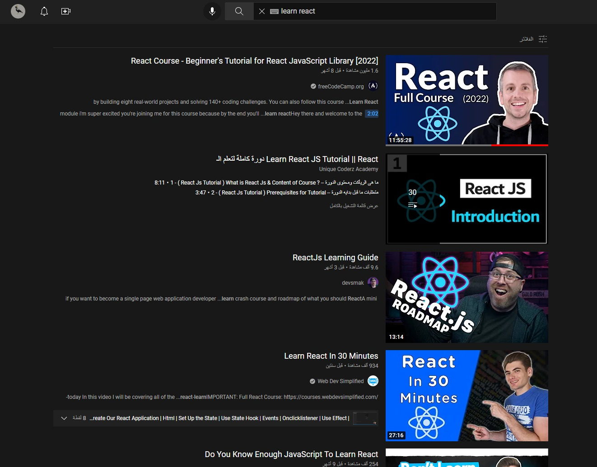
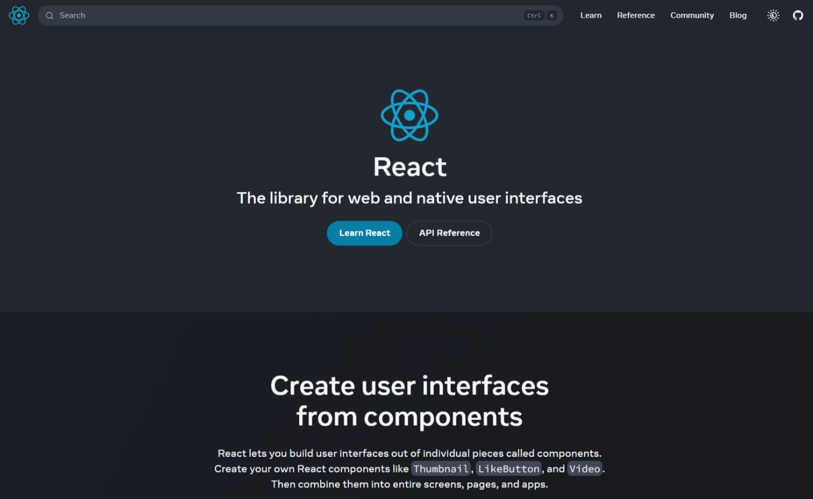
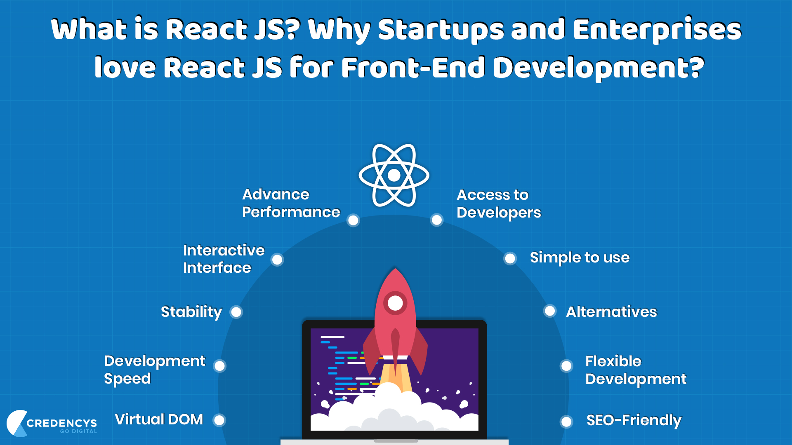
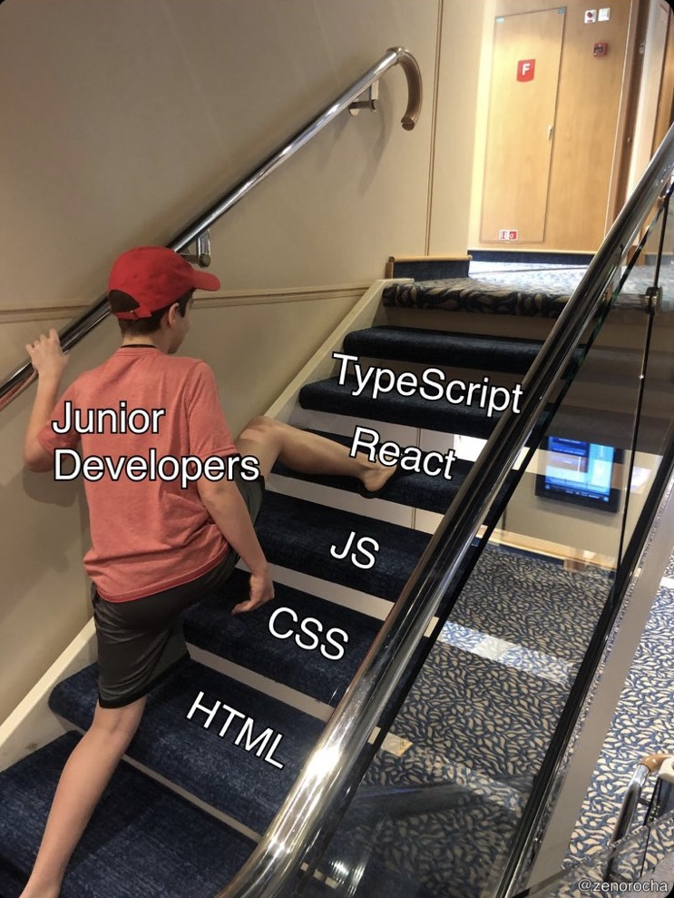
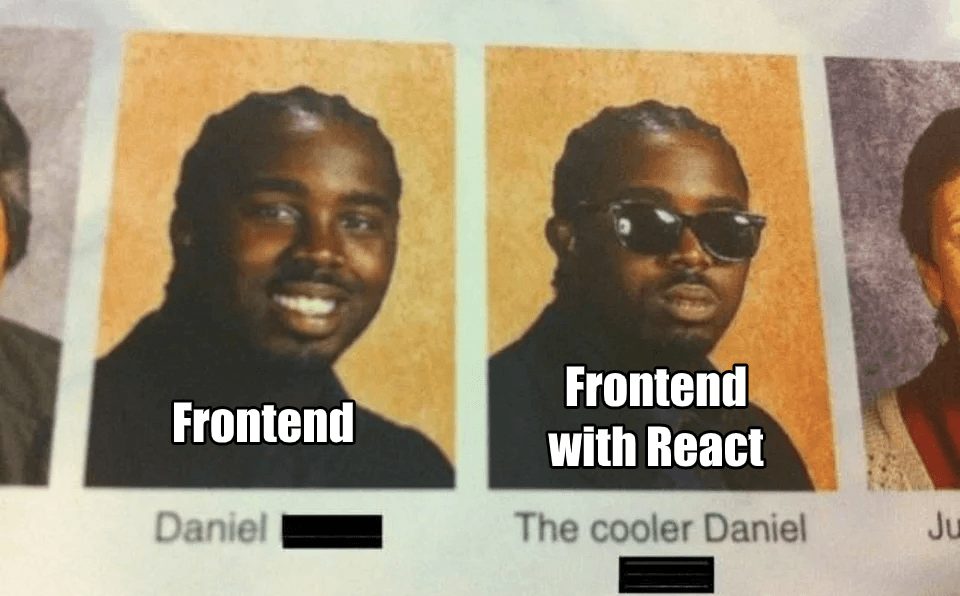
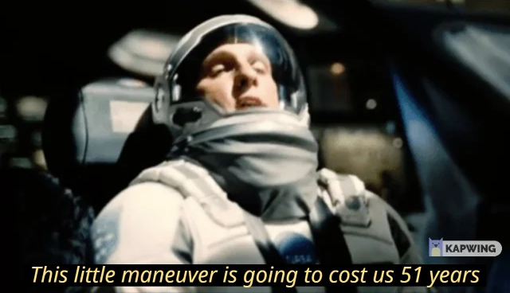
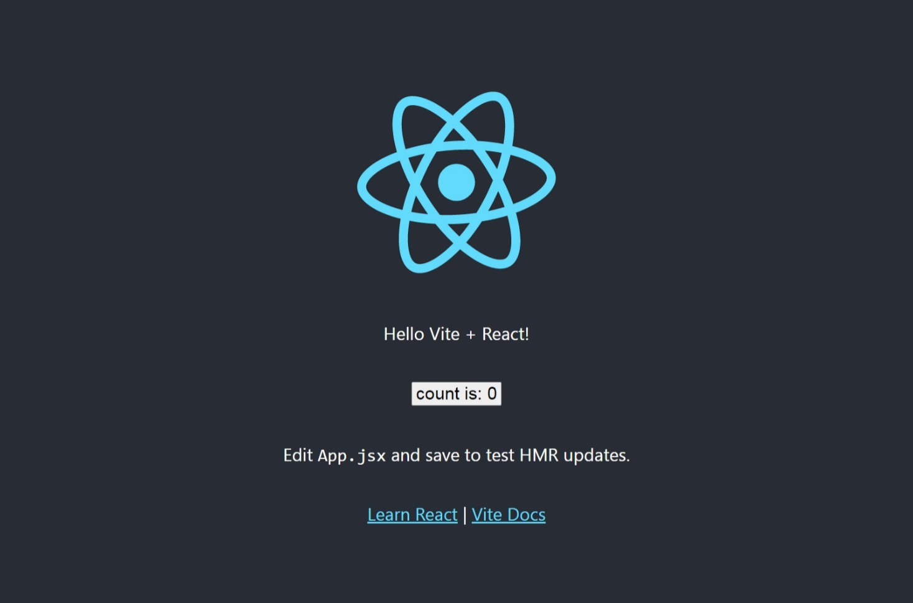
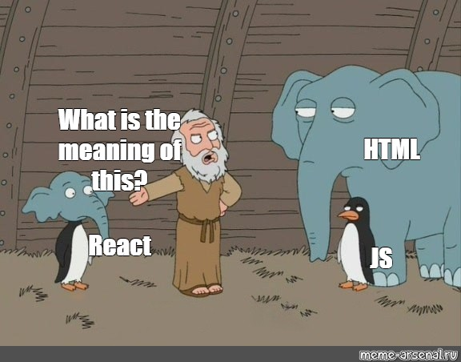

# Introduction:

After a lot of procrastination and giving myself a million reasons to not start like:

-   I will finish another project.
-   I can do everything without it right now I don't need it.
-   I don't like Facebook ( **React Made by Facebook** ).
-   I have to master JavaScript first ( **said no one** ).

I finally decided to start learning React.

And for every programmer who once felt that he did not deserve to be a programmer at the beginning of any course, I decided to record my trip in all its details.

Since if I succeed in learning it at the current level of my intelligence, I will prove that learning programming depends more on luck than on intelligence.

So in today's article, I will talk about:

-   my journey in learning React.
-   learning resources.
-   tricks, easy and hard stuff.
-   and I will try to summarize what I learned quickly

> as the main objective of this article is not to teach you React, I don't think anyone wants a teacher with only 30 days of experience

## Notes:

-   Any mistakes or lack of information will be corrected After the blogging part.
-   I will attach a link to any feature I will use if you want to know more about it, and of course, I will explain to you why I used it specifically.
-   For credibility, I will also attach the original source which I learned a trick from.

Follow me on Twitter where I post almost daily about my journey in learning programming:

-   [Twitter](https://twitter.com/hafanwy)

All the code shown in this article and more can be found here:

-   [GitHub: 30-Day-React-Learning-Journey](https://github.com/ymhaah/30-Day-React-Learning-Journey)

**Without further ado, let's get started with my 30-Day React Learning Journey**

> Honestly, I don't know if I'll take 30 days to finish React or not, but I just chose it because it looks good in the title.



# day 01 [ Choosing the course ] :

One of the main reasons why I haven't started learning React is because my favorite Mentor hasn't published a React course yet.

> Elzero Web School , He is my favorite Mentor and a legend in the Arab dev community

Although it will be somewhat difficult to find a course that I like, but I am not a beginner in the field.

I've taken many courses in many areas before this, so I kind of know what good sources are from bad sources even before I start.

> Although I will often learn from one source, I will share with you all the courses that I think are good

So let's start looking for the best course for me:

## YouTube:

As usual we will find a [freeCodeCamp](https://www.youtube.com/c/Freecodecamp) course , a lot of, I think they cooperated with every potential Mentor So their courses will be on a special list.

A lot of videos on the type of learning React in 20 minutes or how to learn React, the learning path of React

But after a quick search on YouTube, I found these sources:

-   a [freeCodeCamp + Scrimba](https://www.youtube.com/watch?v=bMknfKXIFA8&list=PLPeqRhIotBsxfNjHfqOuTNZV1m8vFTtYO&index=1&t=15093s&ab_channel=freeCodeCamp.org) course

> Scrimba is The best course platform in my opinion, Where somehow they managed to collect the best Mentor I know in one place, like Kevin Powe

-   [Full Modern React Tutorial](https://www.youtube.com/playlist?list=PL4cUxeGkcC9gZD-Tvwfod2gaISzfRiP9d) by [The Net Ninja](https://www.youtube.com/c/TheNetNinja) I learned bootstrap from him and I had a good experience
-   [ReactJS Tutorial for Beginners](https://www.youtube.com/playlist?list=PLC3y8-rFHvwgg3vaYJgHGnModB54rxOk3), I just chose it because it is a 14 hour course
-   [The Complete React Developer Course](https://www.youtube.com/watch?v=l4G2MVgXFkw&list=PLPeqRhIotBsxfNjHfqOuTNZV1m8vFTtYO&index=2&t=1659s&ab_channel=EnvatoTuts%2B), A small and fast course. I will often use this course as a review after completing the rest

> I have ignored any videos that are less than an hour, as I do not think that they fit what I need, and also all the videos are in English with an understandable accent because I do not want to add any obstacle in the learning process



General courses:

-   I don't know anyone who learned a skill from reading documents But if there is, it will be from [React Docs](https://reactjs.org/docs/getting-started.html), The official website is very good at explaining the content to the point that I may rely on it completely, Honesty it is one of the best documents I've read
-   [w3schools React Tutorial](https://www.w3schools.com/REACT/DEFAULT.ASP) Classic but I don't like their style

> Looking at the average length of the courses with the addition of my laziness, perhaps I will finish the React in a month.

After searching for a long time and reading some articles and watching some videos that I honestly do not remember to share with you the links, I decided that this is enough for today and tomorrow we will start learning React



# day 02 [ Why React ] :

In the beginning, most of the courses give an introduction to what is React, why we need it, what we will learn in the course, and what I need to start the course, and so on.

But these are the good courses, but The rest is a disaster.

They start the course without even telling us what React is or what is a library or a framework.

Without even knowing what I need before starting.

if you don't know what is NPM; You will complete the course thinking you are stupid.

I think there is a poor programmer Somewhere who learned React before CSS by mistake because of this.



So let me explain everything you need to know before you get started.

In order to reach the stage where it is worth learning React, you must at least know the following:

-   [HTML](https://www.w3schools.com/html/default.asp) basics
-   [CSS](https://www.w3schools.com/css/default.asp) basics
-   [JS](https://www.w3schools.com/js/default.asp) basics
-   [Npm](https://nodesource.com/blog/an-absolute-beginners-guide-to-using-npm/) basics

Although I think that if you only know the basics, that you need more time before starting, but who am I to stop you from getting a job in **six months**?

Of course, you need a code editor, the Internet, and perhaps a computer.


## Second, what is React?

Honestly, I am currently still learning and also a bit lazy, so I will copy the definition for now.

> React is a free and open-source front-end JavaScript library for building user interfaces based on UI components.

Translation: React makes the programmers job so easy that they are ready to learn it

If you learn sass I think you already know this feeling.

## What is a library?

A place where pre-made codes are collected from people smarter
than you so that you don't have to do anything yourself.

## why react?

-   React developers are in demand.
-   React is easy and fast to learn ( From what I heard, but we'll see )
-   All cool boys use it.
-   Turns js from a nightmare to a dream or that's what I heard



After all this talk, I think that on the second day, despite the little information I learned about it, but the introduction was enthusiastic for me.

The thing I hate the most about the learning process is not knowing why I'm learning this thing, as I feel in almost all of physics.

So I spent a lot of time learning about what React is and why I need it so that I don't make the same mistake as I did with [pugJs](https://pugjs.org/api/getting-started.html) It might be the least useful thing I've learned.

I also advise you to delve deeper into that to try to arouse the interest of the little programmer inside you, as it will help you complete the learning journey.

# day 03 [ Getting Started ] :

Now after all this talk, how do we start using React?

There are many ways to use React in our projects, But basically we need to have **React** and **ReactDOM** In our project so that we can take advantage of all the basic properties of React.

> There is something called jsx that we will talk about in the future too

## [CDN Links](https://reactjs.org/docs/cdn-links.html)

React provides quick links to use all the basic features,and It provides two versions of the links:

-   development version: easy to handle and modify and more suitable in the development stage.

```
<script crossorigin src="<https://unpkg.com/react@18/umd/react.development.js>"></script>
<script crossorigin src="<https://unpkg.com/react-dom@18/umd/react-dom.development.js>"></script>

```

-   production versions: Minified and optimized production versions of React

```
<script crossorigin src="<https://unpkg.com/react@18/umd/react.production.min.js>"></script>
<script crossorigin src="<https://unpkg.com/react-dom@18/umd/react-dom.production.min.js>"></script>

```

> react recommend to keep the crossorigin attribute set.

```
<script crossorigin src="..."></script>

```

At the beginning of the courses, everyone is advised to use this method for learning, as it is easy to use.

But it is not recommended at the advanced level; Where it affects speed and performance, But for the educational purpose I will use it for the rest of the trip and we will learn the rest of the ways as well.

There is an additional link to something called JSX Added without question for now, we will talk about it in depth in the future.

Now you can use JSX in any `<script>` tag by adding `type="text/babel"` attribute to it.

```
<script src="<https://unpkg.com/babel-standalone@6/babel.min.js>"></script>

<script src="./index.js" type="text/babel"></script>

```

# [create-react-app](https://reactjs.org/docs/create-a-new-react-app.html)



> For this method, I advise you to learn the basics of Npm

it is a tool to create single-page React applications that is officially supported by the React team.

When you use it, it gives you a set of files that contain what you need to start development directly.

It sets up your development environment so that you can use the latest JavaScript features, provides a nice developer experience, and optimizes your app for production.

> You’ll need to have Node >= 14.0.0 and npm >= 5.6 on your machine.

to use it:

```
npx create-react-app my-app
cd my-app
npm start

```

From the meme above, it is clear that this method takes a long time to work; So I recommend you to try [vite](https://vitejs.dev/) They are way faster than normal methods.

I recommend you to watch this video to learn more: [Vite 2.0 Crash Course](https://www.youtube.com/watch?v=LQQ3CR2JTX8&ab_channel=codeSTACKr)



# day 04 [ the first line ] :

> most of the currently available and popular courses are not the latest version of "React-18"
> and if the course owner does not specify; the easiest way is if he uses ReactDOM.render(JSX, root), not root.render(only JSX).

If you don't understand now it doesn't matter.

[React versions](https://github.com/facebook/react/releases)

## Now let's start:

First, open the HTML file you want react to work on, and Add an empty `<div>` tag to mark the spot where you want to display something with React.

I prefer to use an empty `[<main>](https://developer.mozilla.org/en-US/docs/Web/HTML/Element/main)` As if I will use React it will be for the whole site.

we will use an [id](https://developer.mozilla.org/en-US/docs/Web/HTML/Global_attributes/id) To select this item, and It is common to use words like [ app, root, main ] But you are free to choose any id.

```
<main id="app"></main>

```

> If you use Npm way you will find Pre-made files that contain everything you need to get started

## but with CDN links:

-   make sure you use the CDN script links.
-   make a new js file and linked to your html file

## Now it's really time for the first line:

-   Create a variable and link it to the element you create

```
let container = document.querySelector("#app");

```

-   Create a variable and then link it with the first property in React, which is `[createRoot()](https://reactjs.org/docs/react-dom-client.html#createroot)` and It is common to use words like [ react, root, mainRoot, reactRoot ]
-   pass "container" to "createRoot()"

```
const root = ReactDOM.createRoot(container);

```

Wait a minute!
What is ReactDOM, Why did we even do the above?

I Will explain to you:

## What is ReactDOM?

Without complicated words, [ReactDOM](https://reactjs.org/docs/react-dom.html) provides you with the ability to manipulate the Dom.
Where in the previous example it was used to target one of the dom elements.

## Why did we even do the above?

we determined what element React will work in ( the root ).

And as the first use of this root, What do you think about using React to create a new element inside?

```
root.render(<h1>Hallo, react</h1>);

```

`[render()](https://reactjs.org/docs/react-dom.html#render)` used to render an element into the root we just creat.

Did you notice anything strange here?
If you don't notice we just use html straight inside js and it will work!!

Do you remember the link I told you to add without question for now?
yes, [jsx](https://reactjs.org/docs/introducing-jsx.html) is responsible for this blessing but also today we will not talk about it.

This meme is enough for you to expect what it will do



Congratulations, you have used React for the first time.

> If you do not understand any of the above and do not know how to create a variable at all, perhaps programming really depends on intelligence!!

kidding; you just need to review js again.

And here, unfortunately, I must end the article. I know that in terms of quantity, I only talked about things that you can announce in the first quarter of an hour in any course, but remember the purpose of this article is not to learn, but to share with you the experience I went through while learning.

# Conclusion

Thank you to anyone who reads this article, I spent more time writing this article than I did learning React, So I will stop writing for a bit and continue my journey with React.

But I promise to anyone who reads this article that I will complete the entire journey, but the speed will depend on the amount of interaction.

In the end, I would like to hear your opinions about the article?

-   What was missing?
-   Did you like the use of the meme in the article?
-   Should I add more or fewer details?
-   Do I add more explanation or cut it out and only talk about the experience?
